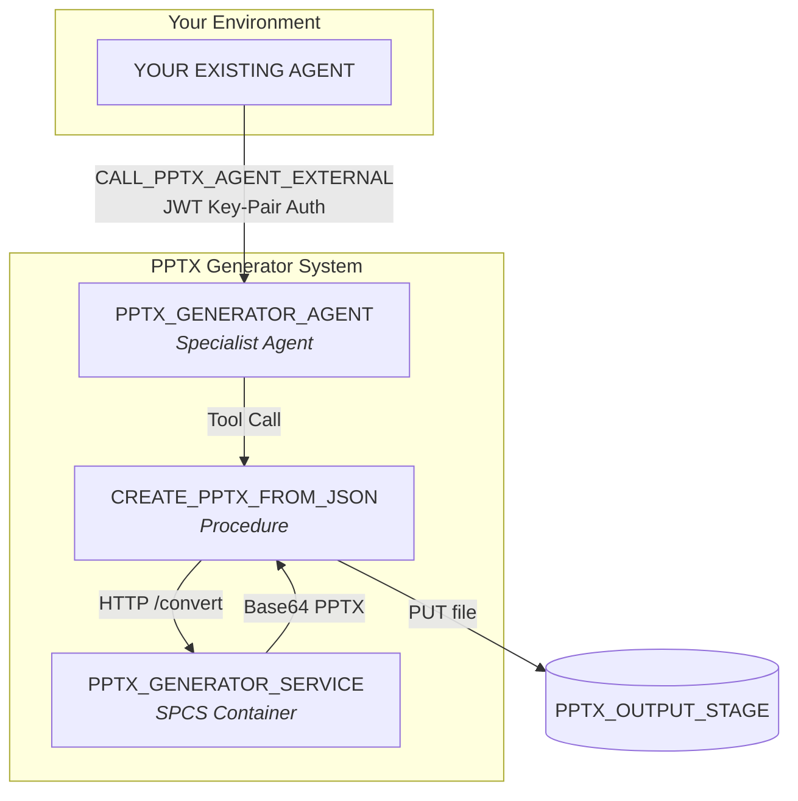
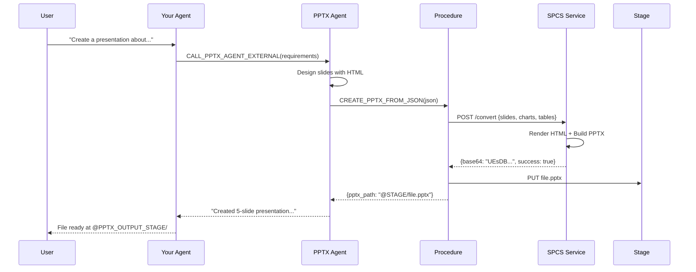
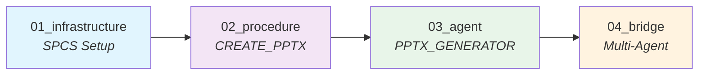
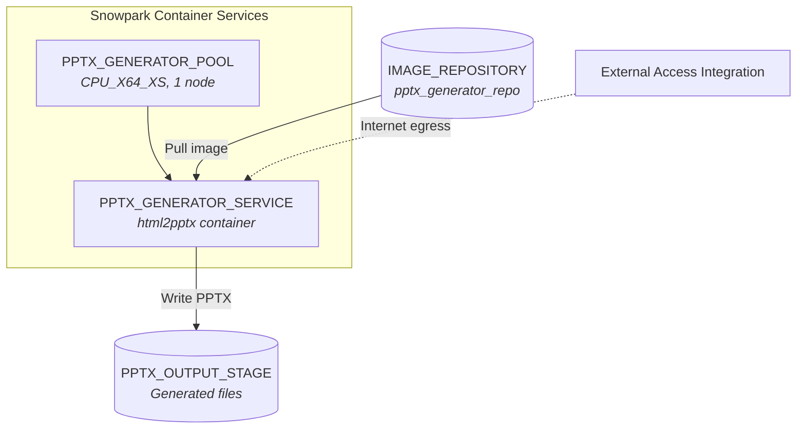

# PPTX Generator Agent for Snowflake Cortex

A complete solution for generating PowerPoint presentations using Snowflake Cortex Agents. Converts HTML slides with charts and tables to native PPTX format.

## Architecture



### Data Flow



## Features

- **HTML to PPTX**: Convert styled HTML slides to native PowerPoint
- **Native Charts**: Bar, Line, Pie, Doughnut charts (via pptxgenjs)
- **Native Tables**: Styled tables with headers and formatting
- **16:9 Format**: Professional widescreen presentations
- **Multi-Agent Ready**: Call from any Cortex Agent via JWT authentication

## Prerequisites

- Snowflake account with SPCS enabled
- Docker installed locally
- Role with CREATE COMPUTE POOL, CREATE SERVICE privileges
- External Access Integration for SPCS

## Quick Start

### Deployment Overview



### 1. Clone and Configure

```bash
git clone https://github.com/evolvconsulting/cortex-pptx-tool.git
cd cortex-pptx-tool
```

Edit placeholders in `sql/` files:

| Placeholder | Description | Example |
|-------------|-------------|---------|
| `{{DATABASE}}` | Your database | `MY_DATABASE` |
| `{{SCHEMA}}` | Your schema | `MY_SCHEMA` |
| `{{WAREHOUSE}}` | Your warehouse | `COMPUTE_WH` |
| `{{ROLE}}` | Admin role | `MY_ADMIN_ROLE` |
| `{{ACCOUNT}}` | Account identifier | `ORG-ACCOUNT` |
| `{{ACCOUNT_URL}}` | Account URL | `org-account.snowflakecomputing.com` |
| `{{EAI}}` | External Access Integration | `ALLOW_ALL_INTEGRATION` |
| `{{IMAGE_PATH}}` | Image repository path | `/my_db/my_schema/pptx_generator_repo` |

### 2. Build and Push Docker Image

```bash
# Login to Snowflake registry
docker login <your-registry-url>

# Build image
docker build -t html2pptx:1.0.0 .

# Tag for Snowflake
docker tag html2pptx:1.0.0 <registry-url>/{{DATABASE}}/{{SCHEMA}}/pptx_generator_repo/html2pptx:1.0.0

# Push
docker push <registry-url>/{{DATABASE}}/{{SCHEMA}}/pptx_generator_repo/html2pptx:1.0.0
```

To get your registry URL:
```sql
SHOW IMAGE REPOSITORIES LIKE 'PPTX_GENERATOR_REPO';
-- Look for repository_url column
```

### 3. Generate RSA Key Pair

```bash
# Generate private key
openssl genrsa 2048 | openssl pkcs8 -topk8 -inform PEM -out rsa_key.p8 -nocrypt

# Extract public key
openssl rsa -in rsa_key.p8 -pubout -out rsa_key.pub

# View keys
cat rsa_key.pub   # For ALTER USER command
cat rsa_key.p8    # For SECRET creation
```

### 4. Create Service User (ACCOUNTADMIN)

```sql
USE ROLE ACCOUNTADMIN;

CREATE USER IF NOT EXISTS PPTX_SERVICE_USER
    TYPE = SERVICE
    COMMENT = 'Service account for PPTX multi-agent bridge';

-- Paste your public key (without BEGIN/END lines)
ALTER USER PPTX_SERVICE_USER SET RSA_PUBLIC_KEY = 'MIIBIjAN...your-key...';

GRANT ROLE {{ROLE}} TO USER PPTX_SERVICE_USER;
ALTER USER PPTX_SERVICE_USER SET DEFAULT_ROLE = '{{ROLE}}';
```

### 5. Deploy SQL Scripts

Run in order:

```sql
-- 1. Infrastructure (wait for service to start ~2-5 min)
@sql/01_pptx_infrastructure.sql
SELECT SYSTEM$GET_SERVICE_STATUS('PPTX_GENERATOR_SERVICE');

-- 2. Procedure
@sql/02_pptx_procedure.sql

-- 3. Agent
@sql/03_pptx_generator_agent.sql

-- 4. Multi-agent bridge (update SECRET with your private key first!)
@sql/04_multi_agent_bridge.sql
```

### 6. Verify Deployment

```sql
SHOW AGENTS LIKE 'PPTX_GENERATOR_AGENT';
SHOW PROCEDURES LIKE '%PPTX%';
SELECT SYSTEM$GET_SERVICE_STATUS('PPTX_GENERATOR_SERVICE');
```

## Integration with Your Agent

Add this tool to your existing agent's specification:

```yaml
tools:
  - tool_spec:
      type: "generic"
      name: "CALL_PPTX_AGENT_EXTERNAL"
      description: "Creates PowerPoint presentations via PPTX specialist agent"
      input_schema:
        type: "object"
        properties:
          user_query:
            type: "string"
            description: "Complete request with presentation requirements and data"
        required:
          - "user_query"

tool_resources:
  CALL_PPTX_AGENT_EXTERNAL:
    type: "procedure"
    identifier: "{{DATABASE}}.{{SCHEMA}}.CALL_PPTX_AGENT_EXTERNAL"
    execution_environment:
      type: "warehouse"
      warehouse: "{{WAREHOUSE}}"
      query_timeout: 300
```

## Usage

### Direct Procedure Call

```sql
CALL CREATE_PPTX_FROM_JSON('{
    "filename": "quarterly_report",
    "slides": [
        {
            "html": "<body style=\"width:720pt;height:405pt;background:#2E3952;display:flex;align-items:center;justify-content:center;\"><h1 style=\"color:#FFF;font-size:42pt;\">Q4 Report</h1></body>"
        },
        {
            "html": "<body style=\"width:720pt;height:405pt;padding:30pt;\"><h1 style=\"color:#2E3952;\">Revenue</h1><div style=\"display:flex;\"><div style=\"flex:1;\"><p>Growth: +28%</p></div><div style=\"flex:1;\"><div class=\"placeholder\" id=\"chart\" style=\"width:350pt;height:260pt;\"></div></div></div></body>",
            "charts": [{
                "placeholderId": "chart",
                "type": "BAR",
                "data": [{"name": "Revenue", "labels": ["Q1","Q2","Q3","Q4"], "values": [10,12,15,18]}],
                "options": {"chartColors": ["D15635"]}
            }]
        }
    ]
}');
```

### Via Agent (Snowsight)

Open `PPTX_GENERATOR_AGENT` and ask:
> "Create a 5-slide presentation about cloud computing benefits with a bar chart showing adoption rates"

### Via Your Agent (Multi-Agent)

From your agent, call CALL_PPTX_AGENT_EXTERNAL:
> "Create presentation with: TOPIC: Sales Review, SLIDES: 6, COLOR PALETTE: Classic Blue, DATA: Q1=$10M, Q2=$12M..."

## JSON Input Format

```json
{
    "filename": "my_presentation",
    "slides": [
        {
            "html": "<body style='width:720pt;height:405pt;'>...</body>",
            "charts": [
                {
                    "placeholderId": "chart-id",
                    "type": "BAR|LINE|PIE|DOUGHNUT",
                    "data": [{"name": "Series", "labels": [], "values": []}],
                    "options": {"chartColors": ["D15635"], "showLegend": true}
                }
            ],
            "tables": [
                {
                    "placeholderId": "table-id",
                    "rows": [["Header"], ["Data"]],
                    "options": {"fontSize": 11}
                }
            ]
        }
    ]
}
```

## Output

Generated files are saved to:
```
@PPTX_OUTPUT_STAGE/{filename}_{YYYYMMDD_HHMMSS}.pptx
```

Download:
```sql
GET @PPTX_OUTPUT_STAGE/my_presentation_20240115_143022.pptx file:///local/path/;
```

## SPCS Components



## Project Structure

```
snowflake-pptx-agent/
├── README.md
├── Dockerfile
├── package.json
├── src/                    # Node.js HTML2PPTX service
│   ├── index.js
│   ├── controllers/
│   ├── converters/
│   ├── services/
│   └── utils/
├── sql/                    # Snowflake deployment scripts
│   ├── 00_deploy_all.sql
│   ├── 01_pptx_infrastructure.sql
│   ├── 02_pptx_procedure.sql
│   ├── 03_pptx_generator_agent.sql
│   └── 04_multi_agent_bridge.sql
├── docs/
│   └── agent_instructions.md
```